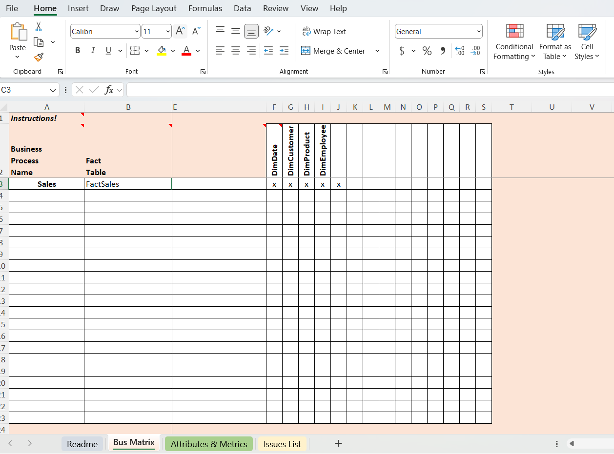

# Implementation of a Data Warehouse with Data Marts Using DBT and SQL Server
***

### Introduction
This report details the implementation of a data warehouse with data marts using SQL Server and DBT (Data Build Tool) while leveraging GitHub for version control. The project follows a structured approach, including high-level and detailed dimensional modeling, database setup, DBT configuration, implementation, and documentation hosting via GitHub Pages.

<a href="./docs/dbtpipeline/index.html"  target="_blank"> Data Build Tool Dashboard   </a>

## Project Workflow

The implementation follows these key stages:
###  High-Level Dimensional Model

The initial step involves designing a high-level dimensional model to represent the business data requirements. The process includes:

Identifying key business processes.

Defining fact and dimension tables.

Establishing relationships between entities.

Creating a star or snowflake schema as appropriate.

###  Detailed Dimensional Model

Building on the high-level model, a detailed dimensional model is developed. This includes:

Defining attributes and keys for each table.

Specifying granularity levels for fact tables.

Ensuring normalization or denormalization based on performance requirements.

### Database Setup in SQL Server

A database is created in SQL Server to store the data warehouse and data marts. This involves:

Setting up the SQL Server instance.

Creating schemas for data marts.

Implementing tables based on the dimensional model.

Establishing indexes and constraints for optimization.

### Setting Up DBT Development Environment

DBT is used to manage transformations and ensure data quality. The setup process includes:

Installing DBT and configuring it to work with SQL Server.

Defining a DBT project structure.

Connecting DBT to the SQL Server database.

Version-controlling the project using GitHub.

### Implementation of Dimensional Model with DBT

The dimensional model is implemented using DBT by:

Creating DBT models for fact and dimension tables.

Writing SQL transformations to populate tables.

Implementing tests and validations to ensure data integrity.

Using DBT macros for reusable logic.

### Generating and Hosting DBT Documentation

To ensure transparency and maintainability, DBT documentation is generated and hosted as a static site using GitHub Pages. The steps include:

Running dbt docs generate to create documentation.

Using dbt docs serve to preview documentation locally.

Committing the documentation files to a GitHub repository.

Configuring GitHub Pages to serve the documentation as a static site.

## Conclusion

The implementation of a data warehouse with data marts using SQL Server, DBT, and GitHub provides a structured and efficient approach to managing business intelligence workflows. The integration of version control ensures collaboration and traceability, while hosting documentation on GitHub Pages enhances accessibility. This approach facilitates efficient data management, transformation, and reporting for business decision-making.
