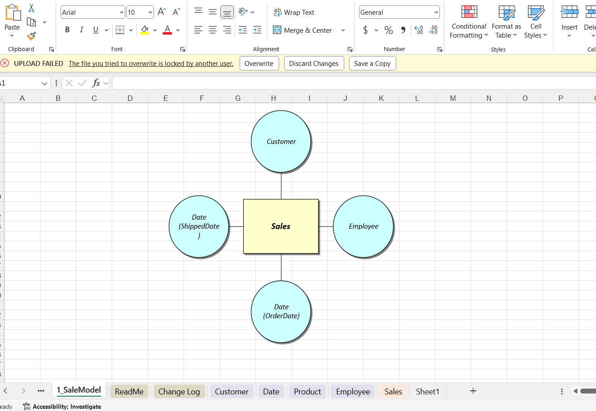

# Implementation 

## Implementation of Dimensional Model with DBT

The dimensional model is implemented using DBT by:

- Creating DBT models for fact and dimension tables.

- Writing SQL transformations to populate tables.

- Implementing tests and validations to ensure data integrity.

- Using DBT macros for reusable logic.

## <a href="./dbtpipeline/index.html"  target="_blank"> Generating and Hosting DBT Documentation   </a>

To ensure transparency and maintainability, DBT documentation is generated and hosted as a static site using GitHub Pages. The steps include:

- Running dbt docs generate to create documentation.

- Using dbt docs serve to preview documentation locally.

- Committing the documentation files to a GitHub repository.

- Configuring GitHub Pages to serve the documentation as a static site.
