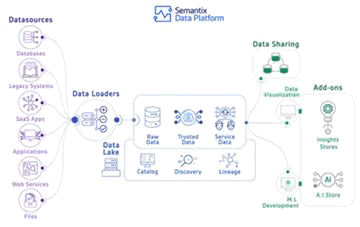

# Implementation of a Data Warehouse with Data Marts Using DBT and SQL Server
***

## Introduction

This report details the implementation of a data warehouse with data marts using SQL Server and DBT (Data Build Tool) while leveraging GitHub for version control. The project follows a structured approach, including high-level and detailed dimensional modeling, database setup, DBT configuration, implementation, and documentation hosting via GitHub Pages.

***

<a href="./dbtpipeline/index.html"  target="_blank"> Data Build Tool Dashboard   </a>

*** 

## Project Workflow

The implementation follows these key stages:

- High-Level Dimensional Model
- Detailed Dimensional Model
- Database Setup in SQL Server
- Setting Up DBT Development Environment
- Implementation of Dimensional Model with DBT
- Generating and Hosting DBT Documentation
- Conclusion

A modern data platform provides the foundation for seamless data integration, storage, processing, and analysis. In this post, I’ll explore why businesses need a strong data infrastructure, how platforms like the Semantix Data Platform address these needs, and how my expertise as a data warehouse and data engineering consultant can help organizations build scalable, efficient data ecosystems.

